<div align="center">

<!-- Animated banner — place banner.svg in repo root -->


<br/>


<br/>

> *"Information is the resolution of uncertainty."*

</div>

---

## `// OVERVIEW`

**NIARAD** is a fully offline, privacy-first AI assistant built on local LLMs via Ollama. It answers general questions out of the box — and when you upload your study material, it switches into document-aware RAG mode, extracting facts, parsing schedules, and summarizing lectures with **zero cloud dependency**.

```
No API keys. No internet required. No data leaves your machine.
```

---

## `// FEATURES`

<table>
<tr>
<td width="50%">

**`EXTRACTION MODE`**
> Pulls specific facts, dates, venues, and tables from uploaded documents. Outputs Markdown tables for schedules.

**`SUMMARY MODE`**
> Transforms complex lecture slides and notes into structured, bullet-pointed summaries.

**`FREE TIER`**
> Chat without uploading anything. 10 free general-knowledge messages per session.

</td>
<td width="50%">

**`AUTO-ROUTING`**
> Every query is automatically classified as EXTRACTION or SUMMARY — no manual switching needed.

**`SMALL TALK DETECTION`**
> Greetings bypass the router entirely. "hi" gets a response in 1 LLM call instead of 2.

**`PERSISTENT VAULT`**
> Documents indexed via FAISS persist across sessions. Upload once, query forever.

</td>
</tr>
</table>

---

## `// TECH STACK`

| Layer | Technology |
|---|---|
| 🖥 UI | Streamlit |
| 🧠 LLM | Ollama — `llama3.2` |
| 🔢 Embeddings | Ollama — `nomic-embed-text` |
| 🗄 Vector Store | FAISS (local disk) |
| ⛓ RAG Framework | LangChain |
| 📄 PDF Parsing | PyMuPDF |
| 📊 Excel/CSV | openpyxl, csv |
| 📝 Word/PPT | docx2txt, python-pptx |

---

## `// PROJECT STRUCTURE`

```
Local_RAG_Bot/
│
├── app.py                    # Main Streamlit application
│
├── core/
│   ├── loaders.py            # File loading & text chunking
│   ├── vector_store.py       # FAISS index management
│   └── logic_engine.py       # LLM chains & query routing
│
├── faiss_index/              # Auto-created on first upload
│
└── .streamlit/
    └── config.toml           # Dark theme config
```

---

## `// INSTALLATION`

**Prerequisites**
- Python `3.10+`
- [Ollama](https://ollama.com) installed and running

<br/>

**1 — Clone**
```bash
git clone https://github.com/AbdulGhaffarcs/Kryptos-Niarad.git
cd Kryptos-Niarad
```

**2 — Install dependencies**
```bash
pip install streamlit langchain langchain-community langchain-ollama langchain-core
pip install langchain-text-splitters faiss-cpu pymupdf python-pptx openpyxl docx2txt
```

**3 — Pull Ollama models**
```bash
ollama pull llama3.2
ollama pull nomic-embed-text
```

**4 — Create theme config**

Create `.streamlit/config.toml`:
```toml
[theme]
base = "dark"
backgroundColor = "#080B0F"
secondaryBackgroundColor = "#0D1117"
textColor = "#C8D6E5"
primaryColor = "#00FFAA"
```

**5 — Launch**
```bash
streamlit run app.py
```

---

## `// USAGE`

### Upload & Index Documents
1. Upload files via the **sidebar uploader** (PDF, DOCX, PPTX, XLSX, CSV)
2. Click **UPDATE LOCAL BRAIN** to index them into the local vault
3. Once the vault is online — all queries run through RAG automatically

### Response Mode Badges

| Badge | Meaning |
|---|---|
| `EXTRACTION` | Pulled specific facts or tables from your indexed documents |
| `SUMMARY` | Explained a concept or summarized content from documents |
| `GENERAL MODE` | Answered from LLM base knowledge — no docs indexed |
| `NIARAD` | Small talk response — router bypassed for speed |

### Sidebar Controls

| Button | Action |
|---|---|
| `UPDATE LOCAL BRAIN` | Index uploaded files into the FAISS vault |
| `CLEAR VAULT` | Delete all indexed documents from disk |
| `CLEAR HISTORY` | Reset the current chat session |

---

## `// SUPPORTED FILE TYPES`

```
  .pdf    →  PyMuPDF loader
  .docx   →  Docx2txt loader
  .pptx   →  python-pptx (slide-by-slide extraction)
  .xlsx   →  openpyxl (sheet-by-sheet extraction)
  .csv    →  built-in csv reader
```

> ⚠ Image-based / scanned PDFs won't extract text. Use OCR-processed PDFs.

---

## `// PERFORMANCE`

| Query Type | LLM Calls | Speed |
|---|---|---|
| Greeting / small talk | 1 | Fast (~5–15s warm) |
| General question (no docs) | 1 | Fast (~5–15s warm) |
| Document query (RAG) | 2 | Medium (~10–30s warm) |
| First ever message | 1–2 | Slow (~20–60s, model loading) |

> 💡 Requires **8GB+ free RAM** for comfortable performance with `llama3.2`.

---

## `// TROUBLESHOOTING`

| Error | Fix |
|---|---|
| `ModuleNotFoundError: faiss` | `pip install faiss-cpu` |
| `cannot import langchain.schema` | Use `from langchain_core.documents import Document` |
| `unhashable type: 'dict'` | Use single `{}` not double `{{}}` in chain dicts in `logic_engine.py` |
| Bot slow on first message | Normal — Ollama loading model into RAM. Wait 30–60s |
| No text extracted from PPTX | Ensure file is `.pptx` not legacy `.ppt` |
| UI shows in light theme | Ensure `.streamlit/config.toml` exists with `base = "dark"` |
| `Pydantic V1` warning on Python 3.14 | Downgrade to Python 3.11 for full compatibility |

---

<div align="center">

```
NIARAD v2.0  //  BUILT FOR STUDENTS  //  OFFLINE  //  AIR-GAPPED  
```

</div>
